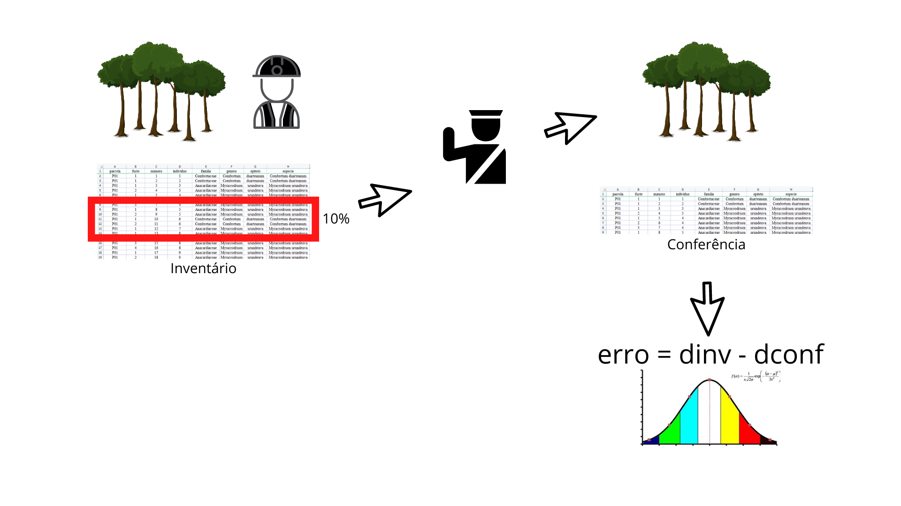

O Brasil possui uma das legislações ambientais mais completas do mundo (CHIAVARI; LOPES, 2017). A Constituição Federal de 1988 estabeleceu regras de competência comuns e concorrentes em relação ao meio ambiente e entes federativos, em seus artigos 22, 23 e 24 (BRASIL, 1988). Como resultado, estados e municípios podem legislar sobre situações mais pontuais, com a cautela de ser subordinada hierarquicamente aos regramentos concorrentes. 

A intervenção ambiental é um termo usado na legislação ambiental e pode ser definido como qualquer intervenção sobre a cobertura vegetal nativa ou sobre área de uso restrito, ainda que não implique em supressão de vegetação (MINAS GERAIS, 2019). De forma geral, o processo para solicitação de intervenção ambiental tem como um dos documentos obrigatórios a apresentação de um Inventário Florestal. 

O inventário deve atender a certos requisitos técnicos. No estado de Minas Gerais por exemplo, o erro de amostragem máximo deve ser de 10% da média do volume para uma probabilidade de 90% de confiança (MINAS GERAIS, 2013). Cada estado avançou de forma independente quanto aos procedimentos para fiscalização, conferência e validação destes inventários. Existem dos mais diversos procedimentos, que varia de uma simples conferência de processamento até a remedição de parte das parcelas na busca de se detectar eventuais desvios. 

Até recente, no Estado de Minas Gerais, a análise do inventário florestal deve ser precedida de vistoria técnica, durante a qual conferia-se no mínimo 10% das parcelas e no mínimo três parcelas por estrato de amostragem. A vistoria é realizada tendo como acompanhante um representante do empreendimento. 

O objetivo deste trabalho foi avaliar a sensibilidade de duas possíveis abordagens para se analisar inventarios protocolados durante processo de fiscalização. Deseja-se determinar qual o desvio que deve ser detectado durante uma vistoria de campo para fazer com que duas possíveis análises indiquem a rejeição do inventário protocolado junto ao órgão ambiental.
